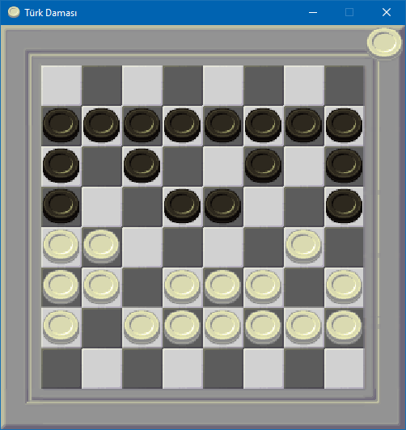

# Turkish Checkers

This is a game that I always loved but unfortunately there is not much implementations of this game so I dedicated to make my own. This was a fun project to make. This is not the cleanest approach but it works fine and it is fun to play.

## Rules
1. **Movement**: 
   - Pieces can move forwards, right, and left one step if the space is empty.
   - Kings can move like a rook in chess and can move as many spaces as they want in any direction as long as there are no enemy pieces in the way.

2. **Capturing**: 
   - You can capture opponent's pieces if there is an empty space behind the opponent's piece.
   - Multiple pieces can be captured in a single turn.
   - If there is a possible capture, you must take the piece(s).
   - Only the longest capture move is allowed. (Not required but I implemented this to make visualization simpler.)

3. **Promotion**:
   - When a piece reaches the last row on the opponent's side, it is promoted to a king.
   - The last three pieces of either side get promoted to kings.

4. **Kings**: 
   - King pieces can move and capture diagonally in both directions and move like a rook in chess.

5. **Winning**: 
   - The game is won by capturing all of the opponent's pieces.

## Controls
- Use the mouse to select and move pieces.
- Click on a piece to see available moves.
